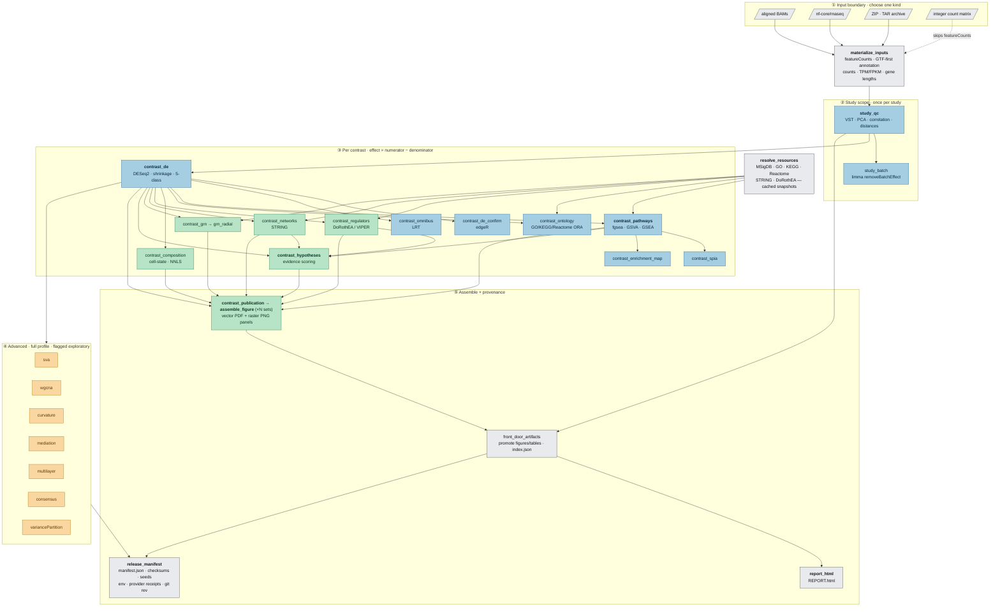

# Tifzoret

[](LICENSE)


<!--
CI and release badges render only against a live GitHub repository. After the
first push to github.com/SecondBook5/Tifzoret, move these onto the badge line above:
[](https://github.com/SecondBook5/Tifzoret/actions/workflows/ci.yml)
[](https://github.com/SecondBook5/Tifzoret/actions/workflows/container.yml)
-->

Tifzoret is a configuration-driven, end-to-end downstream bulk RNA-seq workflow. It accepts aligned BAMs, nf-core/rnaseq BAM outputs, ZIP/TAR archives containing BAMs, or validated integer count matrices. FASTQ processing remains upstream in nf-core/rnaseq.

The stable v1 target is mouse. The analysis contracts are species-neutral, and the human provider implementation is already exercised at the schema boundary while parity fixtures are completed.

## Who this is for

Tifzoret serves two audiences from the same engine:

- **Running an analysis — no code required.** You describe an experiment, its
  contrasts, and its hypotheses in one configuration file and get a
  publication-grade report and figures back. Start with the
  **[study-authoring guide](docs/authoring-a-study.md)**.
- **Developing or extending the engine.** The package is a small Python CLI over
  a Snakemake workflow with per-rule conda environments. See
  [Repository layout](#repository-layout), the
  [CLI reference](docs/cli.md), and [architecture](docs/architecture.md).

## What it runs

- canonical counting, GTF-first annotation, and length-normalized TPM/FPKM abundance;
- full sample QC, DESeq2 with selectable shrinkage (apeglm/ashr/normal/none), pairwise, coefficient, and likelihood-ratio omnibus contrasts, optional edgeR confirmation, and optional limma batch-corrected PCA/distance views — all as explicit numerator-minus-denominator effects;
- cached MSigDB, GO (BP by default, optional CC/MF), KEGG, Reactome, STRING, and DoRothEA provider stages;
- fgsea, bidirectional ORA across GO/KEGG/Reactome domains, GSVA/ssGSEA, multi-track GSEA curves, optional SPIA pathway-topology impact, and optional Jaccard enrichment-map term clustering;
- relative cell-state signature scoring, optional signature-matrix or packaged-preset NNLS cell-fraction deconvolution, regulator activity, STRING networks, and GRNs;
- configurable hypothesis evidence and publication panels;
- vector PDF/raster PNG figure assembly and a navigable HTML report;
- optional SVA, WGCNA, Ollivier-Ricci co-expression curvature, cross-contrast consensus, per-covariate variancePartition decomposition, mediation/power, multilayer integration, and collection meta-analysis;
- complete checksummed provenance and numerical run verification.

Cell-state results are relative signature/composition scores, not estimated cell fractions. Regulatory, co-expression, and STRING association edges remain explicitly distinguished.

## How it works

The CLI compiles `project.yaml` into a Snakemake DAG: any of four input kinds is
normalized to one canonical count boundary, study-scoped QC runs once, and every
declared contrast fans out through the analysis modules its profile enables
before the results converge on figure assembly, an HTML report, and a checksummed
manifest. Nodes below are the actual workflow rules, colored by the profile that
turns them on.



**Profile tiers** — each is a superset of the one before:
🟦 `standard` (QC · DE · pathways · ontology) · 🟩 `publication` adds composition,
regulators, networks, GRN, hypotheses, and figure assembly · 🟧 `full` adds the
exploratory advanced modules. ⬜ input, resource, and provenance rules run in
every profile. Dashed/conditional rules (`study_batch`, `contrast_de_confirm`,
`contrast_omnibus`, `contrast_spia`, deconvolution) activate only when their
trigger data or flags are present. Full stage-by-stage detail is in
[architecture.md](docs/architecture.md).

## Install and start

**Requirements.** Python 3.11+ and [conda or mamba](https://github.com/conda-forge/miniforge).
The Python package itself is small; the scientific stack it runs — R/Bioconductor
(DESeq2, fgsea, GSVA, …), `subread`/`featureCounts`, and the rest — is provisioned
automatically through per-rule conda environments (byte-exact pinned locks). Pass
`--no-conda` only if you have already provisioned an equivalent environment
yourself (see [`environment.yaml`](environment.yaml)).

```bash
git clone https://github.com/SecondBook5/Tifzoret.git
cd Tifzoret
python -m pip install -e '.[workflow]'
tifzoret init my-study --input counts
tifzoret validate my-study/project.yaml
tifzoret prepare my-study/project.yaml --cores 4
tifzoret dry-run my-study/project.yaml
tifzoret run my-study/project.yaml --cores 4
tifzoret report my-study/project.yaml
tifzoret figures init my-study/project.yaml
tifzoret figures build my-study/project.yaml --cores 4
tifzoret figures gallery my-study/project.yaml
```

Input scaffolds are available for `counts`, `bam`, `nfcore-rnaseq`, and `archive`.
The [CLI reference](docs/cli.md) documents every command and flag.

## Project contract

A study is a small directory that points the engine at its data and choices:

```text
my-study/
├── project.yaml
├── samples.tsv
├── contrasts.tsv
├── hypotheses.yaml          # publication/full profiles
├── hypothesis_panels.yaml   # publication/full profiles
└── figure_recipe.yaml       # publication/full profiles
```

The three publication companion files carry the hypothesis claims, the gene/pathway panels, and the figure recipe. Each may instead be **inlined into `project.yaml`** — as a mapping under `hypotheses.claims`, `hypotheses.panels`, and `publication.recipe` — so an entire study is one self-contained file. This single-file form is what an authoring UI generates and edits; the engine accepts either form interchangeably.

Positive effects always mean `numerator - denominator`. No rule infers direction from group names or sample order.

Profiles:

- `standard`: inputs, QC, DE, pathways, ontology, report, and manifest;
- `publication`: standard plus composition, regulators, networks, hypotheses, publication panels, and assembly;
- `full`: publication plus SVA, WGCNA, mediation/power, and multilayer integration.

Individual modules can be overridden under `analysis.modules`. Small-sample advanced analyses continue when enabled, but warnings are written into summaries, reports, and the release manifest.

## Repository layout

For developers extending the engine:

```text
tifzoret/
├── src/tifzoret/            # Python package
│   ├── cli.py               # `tifzoret` command entrypoint
│   ├── config.py            # project.yaml load + schema validation
│   ├── figures.py           # figure-constructor registry and catalog
│   ├── collection.py        # cross-project collection / meta-analysis
│   ├── verification.py      # `tifzoret verify` golden-reference comparison
│   ├── schemas/             # JSON/YAML schemas for project.yaml + companions
│   ├── templates/           # `tifzoret init` scaffolds (counts/bam/nfcore/archive)
│   ├── data/                # packaged reference data (deconvolution presets + provenance)
│   └── workflow/            # the Snakemake engine
│       ├── Snakefile
│       ├── rules/*.smk      # rule groups: core, providers, modules, advanced, publication, report
│       ├── envs/            # per-rule conda envs + byte-exact locks/
│       └── scripts/         # R and Python analysis + render stages
├── tests/                   # pytest suite + fixtures
├── docs/                    # authoring guide + reference docs
├── environment.yaml         # single-env (`--no-conda`) convenience install
├── pyproject.toml           # package metadata, dependencies, entrypoint
├── Dockerfile / Apptainer.def
└── CITATION.cff · LICENSE · CHANGELOG.md
```

The engine carries no study-specific biology. Each study lives in its own thin
consumer repository and points at the engine through the neutral configuration
contract; see [architecture](docs/architecture.md).

## Commands

```text
tifzoret init
tifzoret validate
tifzoret dry-run
tifzoret prepare
tifzoret run
tifzoret report
tifzoret assemble
tifzoret figures init|catalog|build|gallery
tifzoret verify
tifzoret migrate-config
tifzoret collection validate|run
```

`prepare` stops at the canonical inputs. `verify` compares candidate TSV artifacts with an external reference using declared tolerances. `assemble` reads `figure_recipe.yaml` and creates a vector multi-panel PDF, review PNG, and placement metadata. Full flag-level detail is in the [CLI reference](docs/cli.md).

```bash
tifzoret verify my-study/project.yaml --reference /path/to/golden/results --scope counts
tifzoret verify my-study/project.yaml --reference /path/to/golden/results
```

Legacy migration mode recognizes the established featureCounts and DESeq2
cache layout. It requires exact counts, uses field-specific DE tolerances,
requires identical threshold/direction decisions, and validates PDF/PNG pairs.

## Output contract

```text
results/<project>/<analysis_set>/
├── REPORT.html
├── manifest.json
├── figures/                         # promoted review-facing figures + metadata
├── tables/                          # promoted review-facing displayed data
├── inputs/
├── qc/
├── contrasts/<contrast_id>/analyses/
│   ├── de/
│   ├── pathways/
│   ├── ontology/
│   ├── composition/
│   ├── regulators/
│   ├── networks/
│   ├── hypotheses/
│   ├── publication/
│   └── advanced/
├── publication/<figure_set>/assembled/
└── .cache/{logs,resources}/
```

Every rendered constructor declares PDF, PNG, and displayed-data artifacts. The release manifest records normalized configuration, inputs/results checksums, contrast semantics, provider receipts, random seeds, warnings, environment/container information, and repository revision.

## Documentation

| Document | Read it for |
|----------|-------------|
| [authoring-a-study.md](docs/authoring-a-study.md) | **Start here (no code required)** — describe a study in one file and get a report back. |
| [cli.md](docs/cli.md) | Complete `tifzoret` command and flag reference — the usage "API". |
| [configuration.md](docs/configuration.md) | Every configuration key, input boundary, profile, and the direction convention. |
| [figures.md](docs/figures.md) | The hypothesis-driven figure system: panel constructors, variants, recipes. |
| [methods.md](docs/methods.md) | The statistical and analytical methods, written for a methods section. |
| [architecture.md](docs/architecture.md) | How the CLI, Snakemake workflow, and rendering stages fit together. |
| [migration.md](docs/migration.md) | Moving an existing project onto the engine and verifying prior results. |
| [troubleshooting.md](docs/troubleshooting.md) | Common failures and how to resolve them. |

## Citation

If you use Tifzoret, please cite it via [`CITATION.cff`](CITATION.cff). GitHub
renders this as a "Cite this repository" action once the repository is public.

## License

Tifzoret is released under the [MIT License](LICENSE). © 2026 AJ Book.
